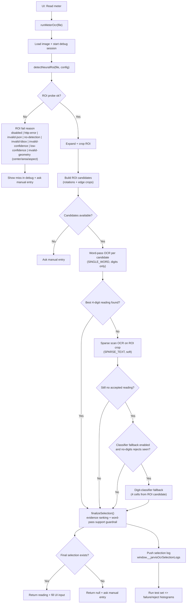

# App Logic

This document describes the current Jarvis OCR execution path, including neural ROI gating and the optional gated classifier fallback.

## End-to-End OCR Flow

## Main Decision Gates

1. Neural ROI gate
   - OCR does not continue unless `detectNeuralRoi` returns `ok: true`.
   - Geometry sanity checks (`centerX`, `centerY`, `area`, `aspect`) are applied before accepting ROI.

2. Candidate availability gate
   - If ROI crop cannot produce valid OCR candidates, the app falls back to manual input.

3. OCR acceptance gate
   - Word-pass result is preferred.
   - Sparse scan is attempted if no word-pass result is available.
   - Optional classifier fallback runs only when enabled and the branch has `ocr-no-digits` rejects.
   - `finalizeSelection` ranks evidence across OCR passes and applies the active word-pass support guardrail (`hits` / `topHits` vs `minWordPassHits`) before returning a value.
   - Default config keeps classifier fallback disabled (`digitClassifier.enabled=false`) because current benchmark shows no MAE gain without exact-match/no-read guardrail safety.

## What Gets Logged

- Per-image selection logs are appended to `window.__jarvisOcrSelectionLogs`.
- The test-set runner reads those logs to build:
  - `Failure Reason` values (`mismatch`, `ocr-no-digits`, etc.)
  - Reject histograms from OCR branch reject reasons.

## Source Files

- OCR orchestration: `src/ocr/pipeline.js`
- Neural ROI probe and sanity checks: `src/ocr/neural-roi.js`
- Candidate generation: `src/ocr/alignment.js`
- OCR ranking/reading extraction: `src/ocr/recognition.js`
- Test-set analysis and histograms: `src/testset/run-test-set.js`
