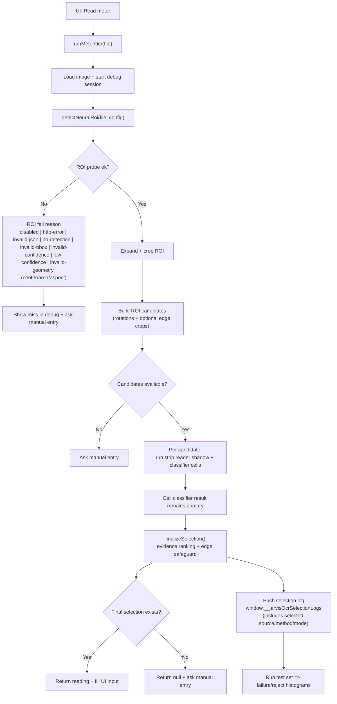

# App Logic

This document describes the current Jarvis OCR execution path, with neural ROI gating, per-cell neural digit-classifier selection, and whole-strip shadow-reader logging.

## End-to-End OCR Flow

## Main Decision Gates

1. Neural ROI gate
   - OCR does not continue unless `detectNeuralRoi` returns `ok: true`.
   - Geometry sanity checks (`centerX`, `centerY`, `area`, `aspect`) are applied before accepting ROI.

2. Candidate availability gate
   - If ROI crop cannot produce valid OCR candidates, the app falls back to manual input.

3. OCR acceptance gate
   - Candidate strips are decoded by splitting into four cells and calling the backend digit classifier.
   - The whole-strip reader also runs for candidates in shadow mode and records direct 4-digit predictions without affecting selection.
   - `finalizeSelection` ranks evidence across classifier passes before returning a value.
   - The selector prioritizes `90/270` edge candidates, but the primary pass also evaluates top base-strip candidates when they are available.
   - A narrow `scan-roi` / base fallback rerun is only used when base candidates were not already evaluated and the top edge evidence is still weak or edge-only.
   - Weak edge-only reads can still be rejected by configured per-cell confidence thresholds in `finalizeSelection`.
   - Digit classifier is enabled by default (`digitClassifier.enabled=true`).
   - Strip reader shadow logging is enabled by default (`digitStripReader.enabled=true`, `digitStripReader.shadowOnly=true`).

## What Gets Logged

- Per-image selection logs are appended to `window.__jarvisOcrSelectionLogs`.
- `selected` metadata includes `sourceLabel`, `method`, and `preprocessMode` for each accepted reading.
- `stripReader` metadata contains the best shadow whole-strip prediction, confidence, source label, and per-position confidence summary.
- The test-set runner reads those logs to build:
  - `Failure Reason` values (`mismatch`, `classifier-edge-gate-final-drop`, `ocr-no-digits`, etc.)
  - Reject histograms from OCR branch reject reasons.

## Source Files

- OCR orchestration: `src/ocr/pipeline.js`
- Neural ROI probe and sanity checks: `src/ocr/neural-roi.js`
- Candidate generation: `src/ocr/alignment.js`
- OCR ranking/reading extraction: `src/ocr/recognition.js`
- Test-set analysis and histograms: `src/testset/run-test-set.js`
